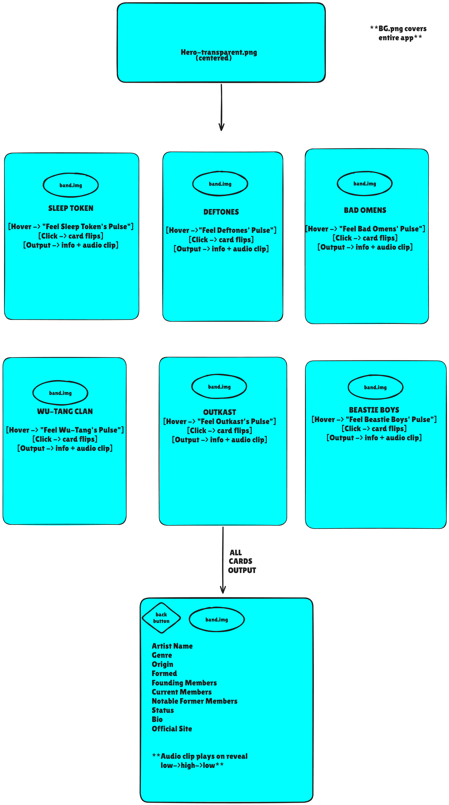
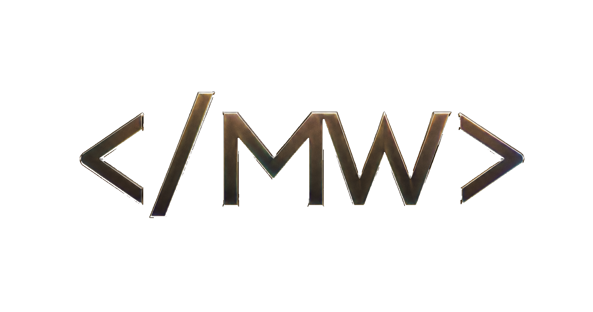

## The problem

A music fan discovering a new band or group needs a quick way to learn who they are and hear what they sound like because that information is often scattered across different places. My app will let them choose from six artist cards, hear a short audio clip, and view a clear profile with the artist's genre, origin, year formed, members, status, bio, image, and official website.

## The plan

### Sections

- **Hero** — the centered Pulse hero introduces the app.
- **Artist cards** — six cards let the visitor choose an artist.
- **Artist detail** — the selected artist's information is displayed with a back button.

### User input

- A visitor clicks an artist card and the page loads that artist's record from the API and shows the artist detail view.

### Outputs

Each result shows `artist_name`, `genre`, and `bio`.

## Data

pulse-artists.csv

| Field                  | Example Value                                                                                        |
| ---------------------- | ---------------------------------------------------------------------------------------------------- |
| id                     | 1                                                                                                    |
| artist_name            | Sleep Token                                                                                          |
| genre                  | Alternative metal                                                                                    |
| origin                 | London England                                                                                       |
| formed_year            | 2016                                                                                                 |
| founding_members       | Vessel; II                                                                                           |
| current_members        | Vessel; II; III; IV                                                                                  |
| notable_former_members | None                                                                                                 |
| status                 | Active                                                                                               |
| bio                    | Anonymous English band known for blending heavy music with atmospheric pop and electronic influences |
| image_url              | https://commons.wikimedia.org/wiki/Special:Redirect/file/ST2024_TPA_%28cropped%29.jpg                |
| official_url           | https://www.sleep-token.com/                                                                         |

### Three Questions

1. Which artists in Pulse are from the same country or region?
2. Which artists formed most recently?
3. Which genres are represented by the artists in Pulse?

## Links

- Live: https://mattwainwright-dev.github.io/capstone/
- Repo: https://github.com/mattwainwright-dev/capstone

## Team

Accountability group:

- @SnDyMrn13
- @Anastasia-2102
- @Hexaxolotl

  

## Image Attributions

- Sleep Token — photo by Wünderbrot, [Wikimedia Commons](https://commons.wikimedia.org/wiki/File:20231007_sleep_token.jpg), [CC BY-SA 4.0](https://creativecommons.org/licenses/by-sa/4.0/).
- Deftones — photo by Khashayar Karimi, [Wikimedia Commons](https://commons.wikimedia.org/wiki/File:Deftones_live.jpg), attribution required.
- Bad Omens — photo by Wünderbrot, [Wikimedia Commons](https://commons.wikimedia.org/wiki/File:20231006_bad_omens.jpg), [CC BY-SA 4.0](https://creativecommons.org/licenses/by-sa/4.0/).
- Wu-Tang Clan — photo by Festival Eurockéennes, [Wikimedia Commons](https://commons.wikimedia.org/wiki/File:Wu-Tang_Clan.jpg), [CC BY 2.0](https://creativecommons.org/licenses/by/2.0/).
- Outkast — photo by David Shankbone, [Wikimedia Commons](https://commons.wikimedia.org/wiki/File:OutKast_Andre_3000_Big_Boi_Performing_Shankbone_2014.jpg), [CC BY 3.0](https://creativecommons.org/licenses/by/3.0/).
- Beastie Boys — photo by Masao Nakagami, [Wikimedia Commons](https://commons.wikimedia.org/wiki/File:Beastie-boys.jpg), [CC BY-SA 2.0](https://creativecommons.org/licenses/by-sa/2.0/).
